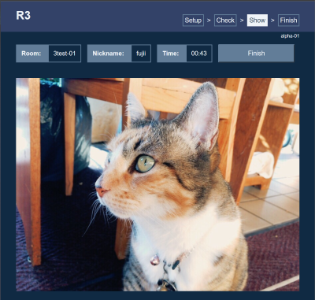

# R3
Simple web-based system to support various internal hypothetical-based experiments to improve people's creativity.



## Getting started
- To participant - Read a [tutorial](static/tutorial.html) (sorry in Japanese) from application main screen to join the experiment.
- To host of experiment - Read this document to develop and/or deploy this system in your own environment.

## System requirements
- Server : [Python](https://www.python.org/) 3.7 and [Django](https://www.djangoproject.com/) 3.1. Depended modulses are described in [requirements.txt](requirements.txt).
- Client : Modern browser that supports JavaScript and HTML5. Chrome, Firefox, and New Edge would be fine. I am very sorry that IE11 does not work correctly due to lack of CSS support.

## Restrictions and known issues
1. This system does not provide any original media streaming / decoding mechanism, so supported media format is completely depends on the client browser and codecs. For example, legacy quicktime format which basically has .mov extention does not supported by latest browsers. Hence If you need to use your original good old family movie recorded by traditional digital camera, you may have to convert that to mp4. [FFmpeg](https://ffmpeg.org/) cound be a solution in the case.
1. Back-end media storage always accepts any data as a media file. But client-side javascript (see [play.html](r3/templates/play.html)) that handles media data is restricted to mp4, ogg, webm, jpg, and png only.
1. Max size of media file should be less than 30M bytes. Modify [models.py](r3/models.py) if you have to change this limitation.
1. User can anytime use any browser buttons like a "back" and "reload". There is no impact to the system from data consistency point of view, but it might be confused from experiment participant point of view.
1. Experiment host has to update every Logics when new Media file has been added. At this stage, this process called "Prep" is implemented as a part of synchronous HTTP handler. So perhaps client browser will be timed-out in "Prep" process if bunch of media files registererd in the system. Data stored back-end will be updated successfully even if client is timed-out. So I think this is not a critical issue at the moment.
1. Feature to showing some keyword as a hint instead of image or movie is not implemented yet. Please concider to use a tool named [RandomViwer.html](local_tool/RandomViewer.html) for that.

## Install to your development environment
If you already had a development environment with Python 3, following steps (as like general Django application) will installs the system to your environment, and just starts it on 'Debug' mode.
```
$ pip instll -r requirements.txt
$ ./manage.py check
$ ./manage.py makemigrations
$ ./manage.py migrate
$ ./manage.py createsuperuser
$ ./manage.py runserver
```
Now you can acccess http://localhost:8000 to get application main screen and http://localhost:8000/manager to open Django built-in administration application with superuser regstered in above step. Be sure that path to administration screen has been changed from default value "admin" to "manahger" for security reason. And also you can use `gunicorn --bind:0.0.0.0:8000 pbl.wsgi` instead of `manage.py runserver` as similar to the production environment.

### Setup data for your test drive
To prepare minimam data, follow below steps in the administration application.
 1. Add your several media files (should be jpg or mp4) using "Media" menu.
 1. Create your own experiment logic using "Logic" menu. Be sure that "default_logic" might be in the param field.
 1. "Prep" your logic using "Prep selected logics" menu in the Logic list. This operation assigns relavant media files to the logic.
 1. Launch main application with http://localhost:8000 and try to start your experiment using the logic you created.

## Install to your production environment
 I have decided to use [Microsoft Azure](https://azure.microsoft.com) as my production environment. And the system will be deployed automatically when code has been comitted to this GutHub repository "main" branch. Regarding deployment to Azure, please read separated document [How to deploy to Azure](doc/PRODUCTION.md).

## To-do and ideas list
I will try to handle following issues if I have a time...
1. Developing a new logic that uses participant specified keywords, and retrieves media files from the internet automatically. I have an idea to use [MediaWiki](https://www.mediawiki.org/) REST API to getting relavant "safe and free" movie files.
1. Isolate "Prep" task from Django main thread to supports more complecated and time-consuming algorithms in the logic module. Using [django-background-tasks](https://django-background-tasks.readthedocs.io/) could be a solution. may be a custom startup script for production environment also needed, and then "Prep" might be start automatically.
1. Obviously current design of Logic.media_list is neither safety nor scalable. So to reconsider data relationship between Logic and Trial once again.
1. To add a feature to supports text (keywords) as a Media object.
1. To add more logger for trouble shooting in production environment.
1. To add more comments based on the Python docstrings style.
1. There is no test code. Yes, I understand, it's unbelievable in 2020. I have to write some tests to cover vital part of this system. And someday to concider to CI and CD if the system improved continually.
1. To add transition effects in playback screen. I had try to add fancy effects using CSS animation features, but it was a bit complecated work for me...
1. Should I improve the user interface using fancy UI framework like Bootstrap or Vue ? I think Plain HTML5 and CSS might be enough for me at this stage...
1. To add a README to the local_tools folder.
1. Adding favicon and cool logo if somebody donated to me.

### Tips for Python / Django developer
1. To writing reliable Python code, [flake8](https://pypi.org/project/flake8/), [isort](https://pypi.org/project/isort/), and [black](https://github.com/psf/black) would be great tool. Not only for the IDE integration but also as an independent tool. See also [pep8](https://pep8.readthedocs.io/).
1. To checking current version of installed python modules, use ```pip list --outdated```.

## Feedback
Pull requests, feature ideas and bug reports are very welcome!

## References
Many thanks to all of authors.
 - [Django on Azure - beyond "hello world"](https://tonybaloney.github.io/posts/django-on-azure-beyond-hello-world.html)
 - [DjangoにPostgreSQLを適用する](https://qiita.com/shigechioyo/items/9b5a03ceead6e5ec87ec)
 
