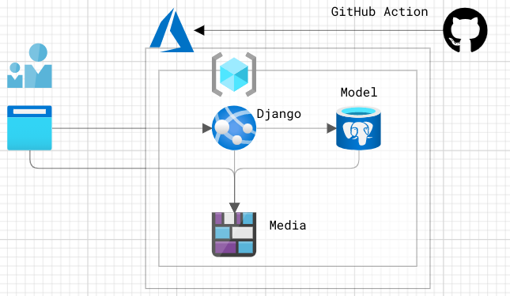

# How to deply to Azure

## Brief architecture
- Application Server is Azure App Service
    - Connection : Client browser -> App Service (nginx -> gunicorn -> django)
    - All static files are inside the app service local file system using whitenoise middlwware.
- Database Server is Azure Database Service for PostgreSQL
    - Connection : App Service -> Database service (PostgerSQL)
    - All objects defined by models except media files are stored here.
- Blob storage is Azure Blob Storage Service
    - Connection : Client browser -> Blob Storage.
    - All media files are stored here.
- Code repository is GitHub
    - Deployment : Automated using Github Actions.



---

## Setup account
 1. Create your Azure Account, Subscription and Resource Group. 
 
## Setup Azure Database Service
1. Setup PostgreSQL service instance.
    - Connectivity method : Public access.
    - PostgreSQL Version : 11
1. Add your client IP to firewall to configure the service using psql cli. Note that I think the cloud shell could be better but it does not work correctly in my environment.
1. Connect to the service instance.
    ```
    psql host=<host name> (e.g. hoge.postgres.database.azure.com) port=5432 dbname=<db name> (e.g. postgres) user=<db admin name> (e.g. psqladmin)
    ```
1. Create database and db admin account. be sure to use a complex password!
    ```
    CREATE DATABASE r3;
    CREATE USER <db admin name> WITH PASSWORD <db admin password>;
    ALTER ROLE <db admin name> SET client_encoding TO 'utf8';
    ALTER ROLE <db admin name> SET default_transaction_isolation TO 'read committed';
    ALTER ROLE <db admin name> SET timezone TO 'Asia/Tokyo';
    GRANT ALL PRIVILEGES ON DATABASE r3 TO 'db admin name';
    /q
    ```
1. Close session and remove IP from firewall configuration.

## Setup Azure Blob Storage
1. Create storage account. (e.g. hogestorages)
1. Create new container in the storage account. (e.g. hoge-container)
    - Public access level : blob
    - Blob type : Block blob
    - Access tier : hot

## Setup Azure App Service
1. Create App Service Plan.
1. Create App Service for Python Django.
    - Stack : Python
    - Version : Python 3.7
    - FTP state : Disabled
    - HTTP Vesion : 1.1
    - HTTPS Only : on
    - Minimum TLS Version : 1.2
1. Add application settings as follows.
    - DB_ENGINE : POSTGRESQL (see [settings.py](pbl/settings.py))
    - DB_HOST : db url (e.g. hoge.postgres.database.azure.com)
    - DB_NAME : r3
    - DB_USER : db admin name (e.g. psqladmin)
    - DB_PASSWORD : db admin password
    - DB_PORT : 5432
    - MEDIA_STORAGE : AZURE_BLOB (see [settings.py](pbl/settings.py))
    - AZURE_ACCOUNT_NAME : storage account name (e.g. hogestorages)
    - AZURE_MEDIA_CONTAINER : storage container name (e.g. hoge-container)
    - AZURE_STORAGE_KEY : storage key
    - ALLOWED_HOSTS : application url (e.g. hoge.azurewebsites.net)
    - DEBUG : True (will change to False later soon)
1. Configure automatic deployment from Github to Azure App Service using GitHub Actions.
1. To setup database and application admin, start app service and connect that via ssh from the azure console. note that ssh would not work if Debug is "False".
    ```
    # pip install -r requirements
    # manage check
    # manage migrattions
    # manage migrate r3
    # manage createsuperuser
    ```
1. Change Debug to False and restart the service.

---

## Note
1. To improve system overall performance, use smart cache mechanism in both Django and Azure.
1. Using Azure Private VNET would be better for security.
1. To confirm Django application settings, `manage.py check --deploy` will provides some security related information.
